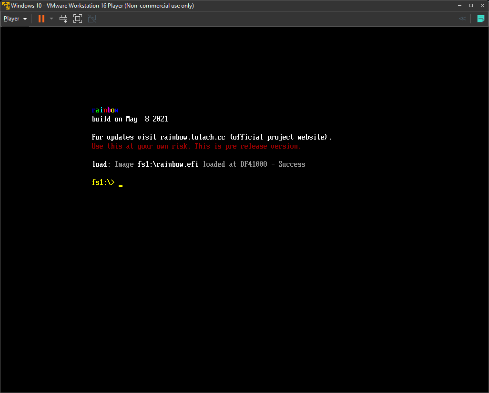
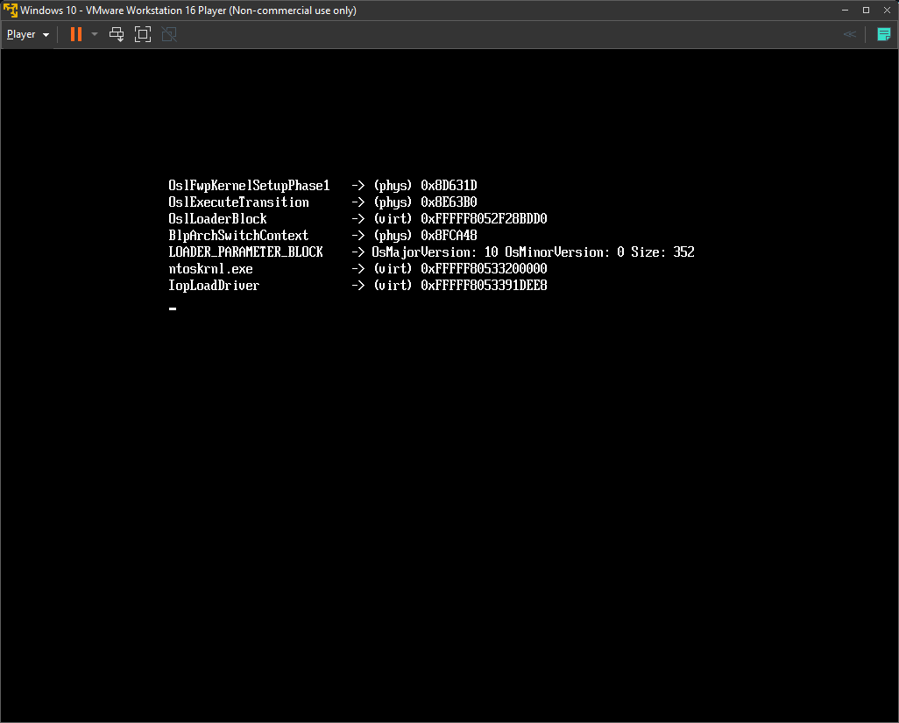
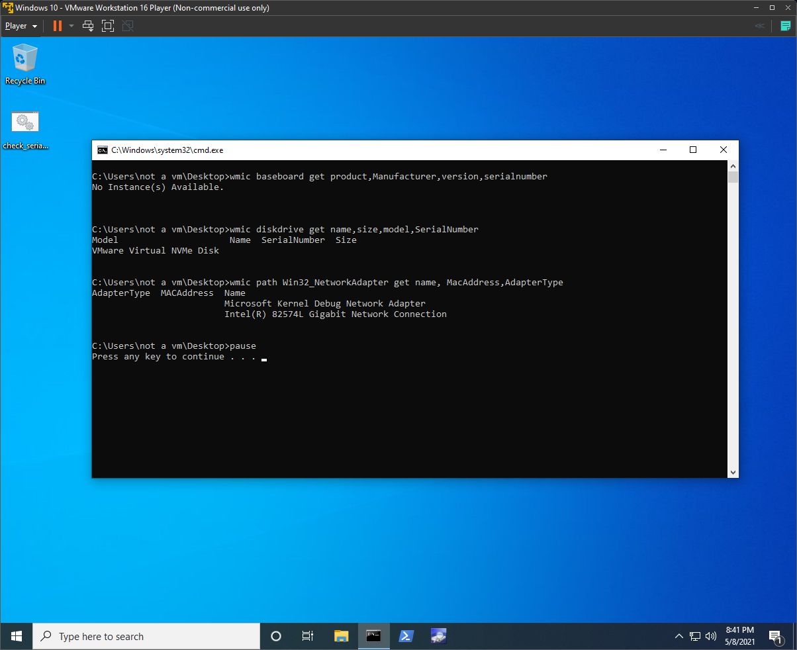

# Rainbow
Rainbow is a bootkit like HWID spoofer for Windows. It abuses several hooks in EFI runtime services and uses clever DKOM to hide hardware serials before any boot-time drivers are even started.
## Screenshots




## Video
[](https://www.youtube.com/watch?v=es3_bP3GU2M)

## Usage
In order to use rainbow spoofer, you need to load it. First, obtain a copy of rainbow.efi and a copy of [EDK2 efi shell](https://github.com/tianocore/edk2/releases). Now follow these steps:

1. Extract downloaded efi shell and rename file Shell.efi (should be in folder UefiShell/X64) to bootx64.efi
2. Format some USB drive to FAT32
3. Create following folder structure:
```
USB:.
 │   rainbow.efi
 │
 └───EFI
      └───Boot
              bootx64.efi
```
4. Boot from the USB drive
5. An UEFI shell should start, change directory to your USB (FS0 should be the USB since we are booting from it) and list files:
```
FS0:
ls
```
6. You should see file rainbow.efi, if you do, load it:
```
load rainbow.efi
```
7. Now you should see output from rainbow. If it was successful, exit and boot into Windows (change to Windows boot media - usually FS1 - and run \EFI\Boot\bootx64.efi)

## Download
Once published, link to UC will be added here.

